<p align="center">
    
</p>

<h1 align="center">Employee Management System</h1>

<p align="center">
    A role-based employee management web application built with <strong>Laravel</strong>, <strong>Laravel Breeze</strong>, and <strong>Tailwind CSS</strong>.<br>
    Designed for learning, CRUD practice, and real-world simulation of HR workflows.
</p>

---

## 🚀 Features Overview

This project now includes a richer feature set with structured role separation between <strong>Admin</strong> and <strong>Employee</strong> panels.

### 🔵 Admin Panel — Full CRUD Modules
| Module | Description |
|---------|-------------|
| **Employees** | Complete employee management with profile pages and login account creation (create-user, edit-user) with advanced search by employee name, departments, and positions. |
| **Departments** | Manage department information and associate employees with departments. |
| **Positions** | Manage company positions with base salary configuration. |
| **Attendances** | Track and manage employee attendance with advanced search by employee name. |
| **Salaries** | Create, update, and calculate salaries with advanced search by employee name and salary month. |

### 🟢 Employee Panel — Self-Service Portal
- **Personal dashboard** with profile, today's attendance status, and latest salary summary.
- Attendance self-service:
  - **Check-in** (prevents double check-in)
  - **Check-out** (prevents double check-out)
- View last 30 days of attendance history.

### 🔐 Authentication & Roles
- Authentication handled by **Laravel Breeze**.
- Role-based access control:
  - `admin`
  - `employee`
- Automatic redirect:  
  `/dashboard` → admin panel or employee dashboard depending on role.
- Each user is linked to an employee record via `hasOne`.

---

## 🛠️ Technologies Used

- **Laravel** — backend framework providing routing, controllers, and MVC structure.  
- **Tailwind CSS** — utility-first responsive UI framework.  
- **Laravel Breeze** — authentication scaffolding with session middleware.  
- **Vite** — lightning-fast asset bundling.  

---

## ⚙️ Requirements

To run this project properly, make sure you have installed:

- **PHP 8.1+**
- **Composer**
- **Node.js**  
  → [Download Node.js here](https://nodejs.org/en/download)

---

## 🧭 How to Run the Project

1. Clone or pull this repository:
   ```bash
   git clone https://github.com/<your-username>/pegawai.git
   cd pegawai
   ```
2. Install PHP dependencies:
   ```bash
   composer install
   ```
3. Install Node.js dependencies:
   ```bash
   npm install
   ```
4. Run the Laravel development server:
   ```bash
   php artisan serve
   ```
5. In a separate terminal, compile and watch frontend assets:
   ```bash
   npm run dev
   ```
6. Visit your app at [http://localhost:8000](http://localhost:8000)

---

## 🖼️ UI Screenshot

### Welcome Page
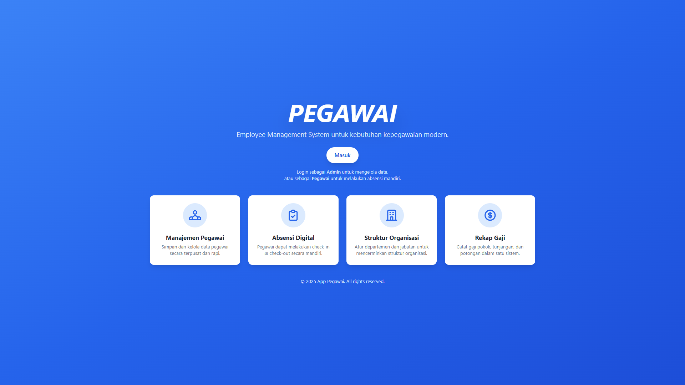

---

### 🔐 Login Page (Powered by *Laravel Breeze*)

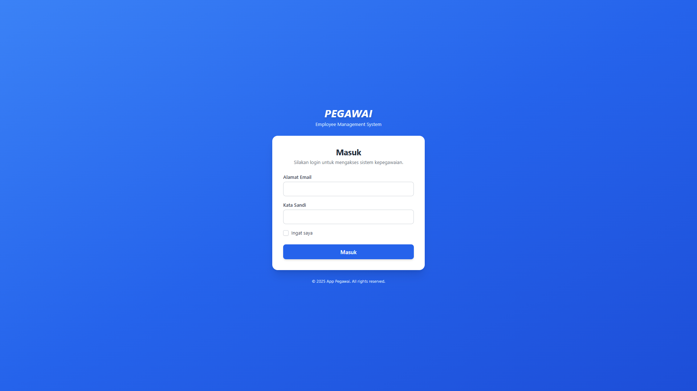

---

# 🔵 Admin Panel

### 👥 Employees
- **Index Page**  
  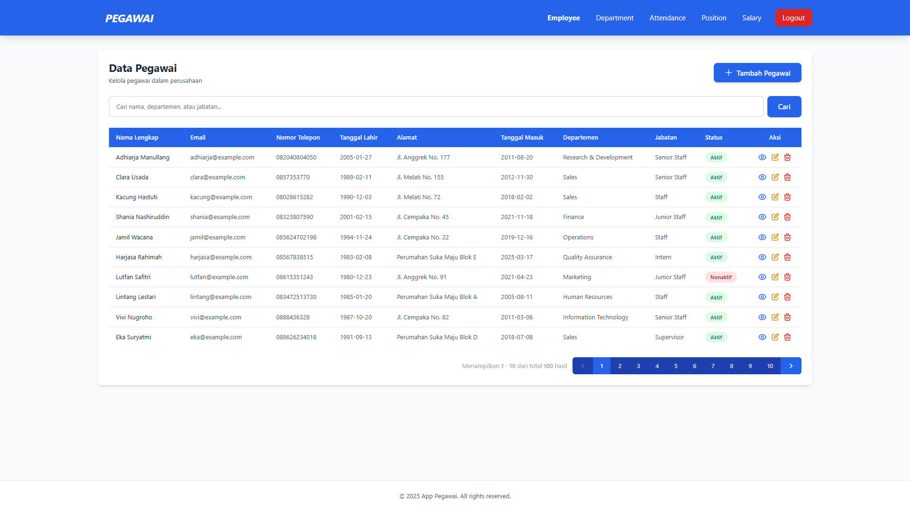

- **Create Page**  
  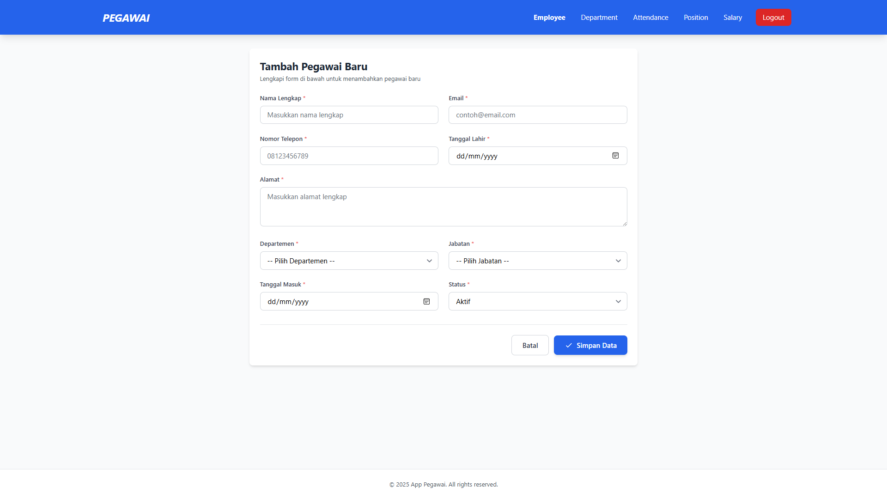

- **Edit Page**  
  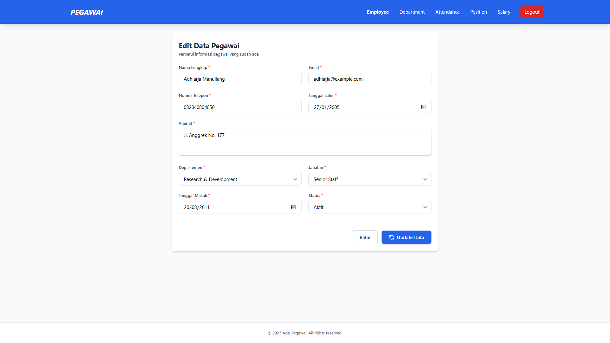

- **Show Page**  
  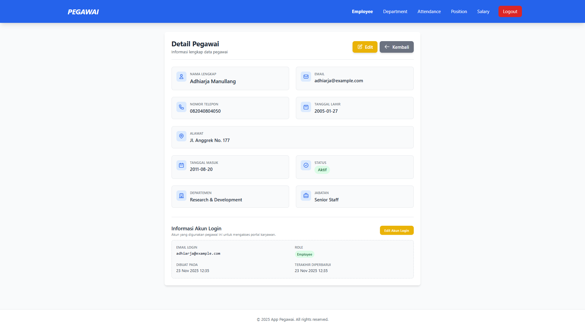

- **Create User Account**  
  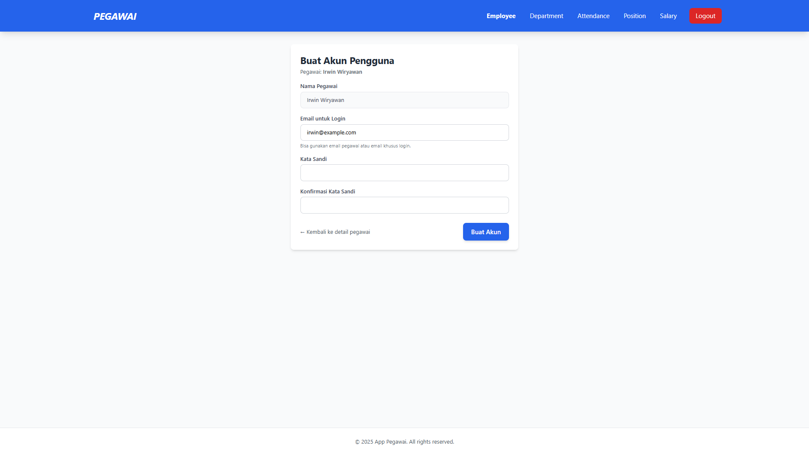

- **Edit User Account**  
  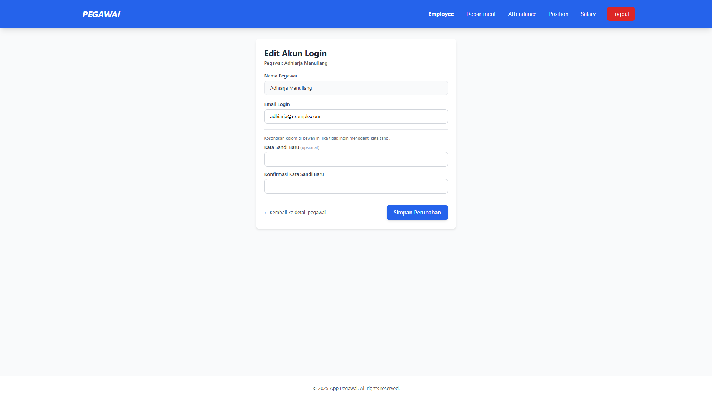

- **Delete Page**  
  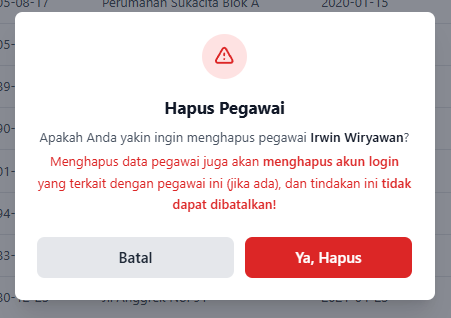

---

### 🏢 Departments
- **Index Page**
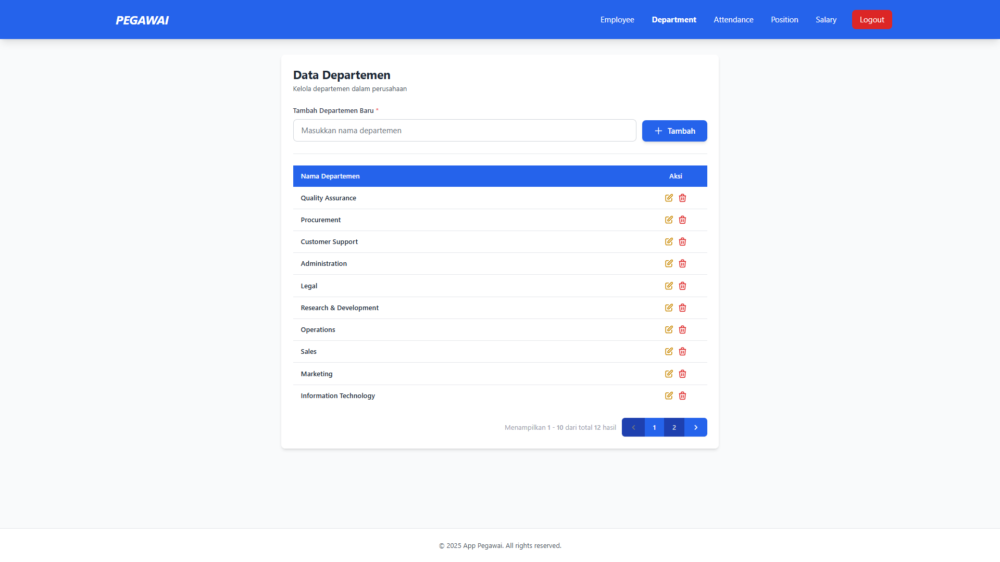

- **Edit Action**
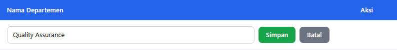

- **Delete Page**
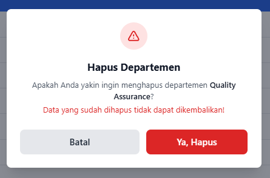

---

### 💼 Positions
- **Index Page**


- **Edit Action**
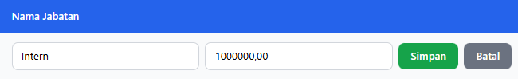

- **Delete Page**
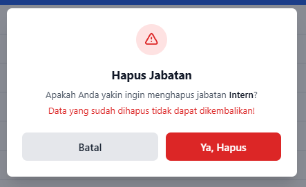

---

### 🕒 Attendances
- **Index Page**
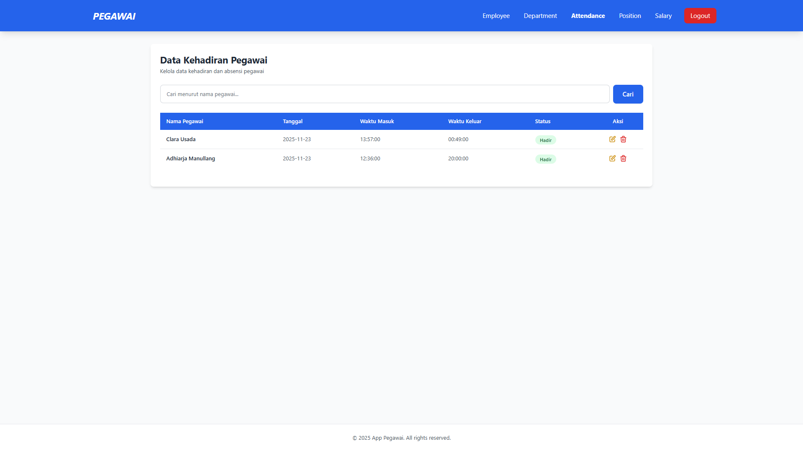

- **Edit Action**
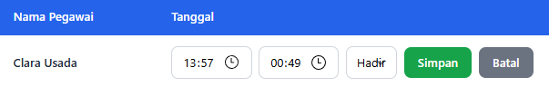

- **Delete Page**
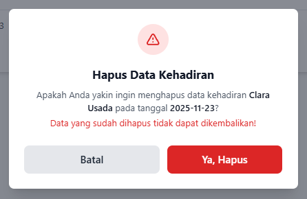

---

### 💰 Salaries
- **Index Page**  
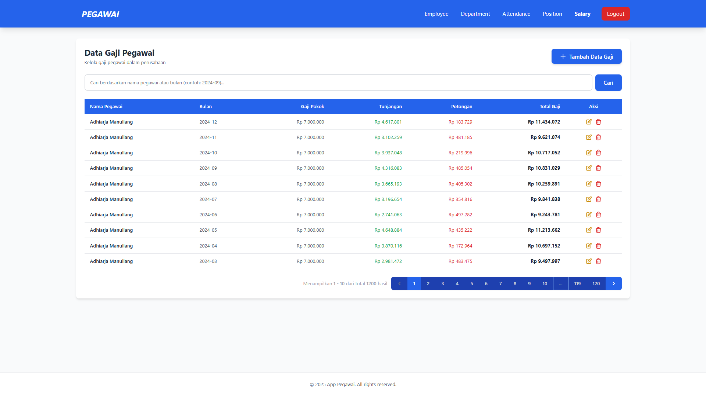

- **Create Page**  
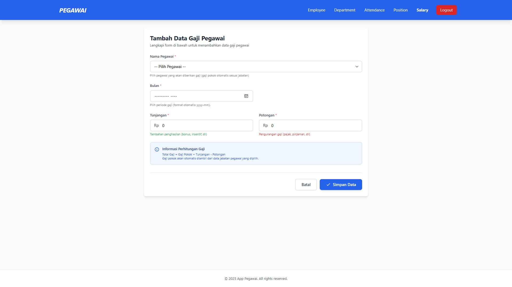

- **Edit Page**  
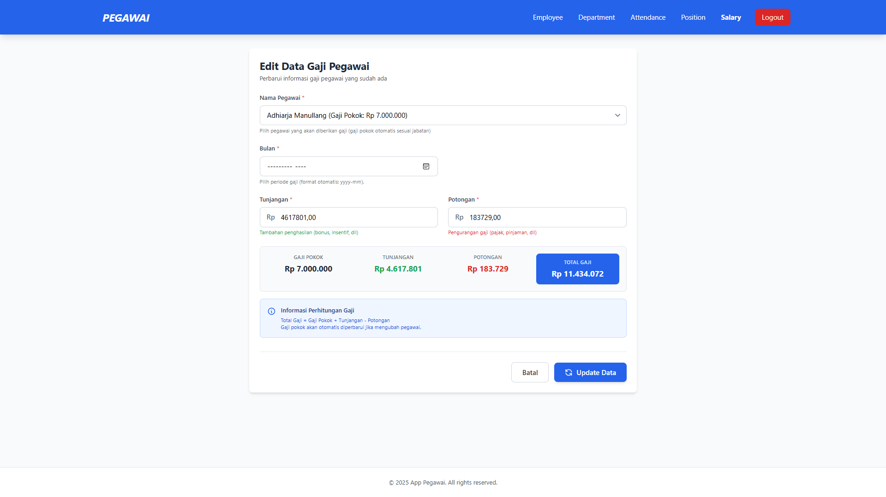

- **Delete Page**  
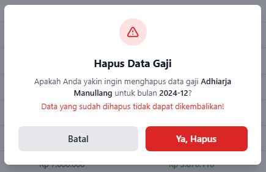

---

# 🟢 Employee Panel

### 🏠 Employee Dashboard
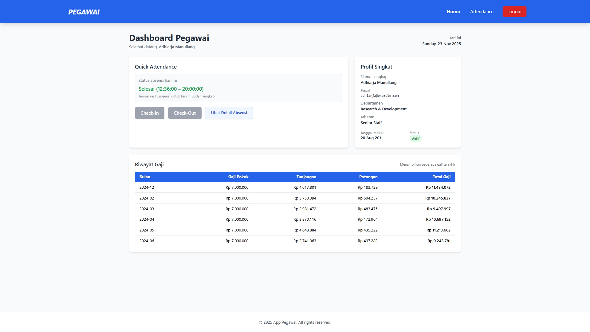

### 🕒 Attendance


---

## 🧑‍💻 Author
Developed by **Irwin Beyond** as part of the <em>Framework Programming Workshop</em> course at EEPIS (PENS).

---

<p align="center">
    <sub>Built with ❤️ using Laravel & Tailwind CSS</sub>
</p>
